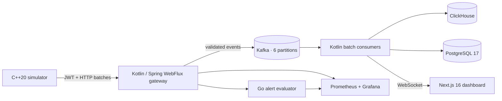

# PulseGrid

[](https://github.com/zezotony605-wq/PulseGrid-Full-Stack/actions/workflows/ci.yml)
[](LICENSE)
[](backend)
[](alerting)
[](simulator)
[](app)

Health and IoT telemetry platform: authenticated device ingestion, Kafka
buffering, asynchronous Kotlin consumers, analytical storage, a Go rule engine
and a live control centre — five languages behind one `docker compose up`.



## Stack

| Layer | Technology |
|---|---|
| Producer | C++20, POSIX sockets, `std::thread` workers, automatic JWT provisioning |
| Gateway | Kotlin 2.1, Spring Boot 3.5, WebFlux, coroutines, Spring Security, OpenAPI |
| Streaming | Apache Kafka 4.3, six-partition topic, idempotent producer, batch consumers |
| Storage | ClickHouse 25.8 for telemetry, PostgreSQL 17 for identity and ingestion audit |
| Alerting | Go 1.24, stdlib-only rule engine with Prometheus exposition |
| Dashboard | Next.js 16, React 19, TypeScript, WebSocket streaming |
| Observability | Micrometer, Prometheus 3.5, provisioned Grafana 12 dashboards |
| Testing | Vitest, JUnit 5, `go test -race`, k6 constant-arrival-rate load test |

## Run the whole platform

```bash
docker compose up --build
```

| Service | URL |
|---|---|
| Dashboard | http://localhost:3000 |
| API | http://localhost:8080 |
| Swagger UI | http://localhost:8080/swagger-ui.html |
| Alert evaluator | http://localhost:8090/api/v1/alerts |
| Prometheus | http://localhost:9090 |
| Grafana | http://localhost:3001 (`admin` / `pulsegrid`; override before shared use) |

The simulator obtains a one-hour JWT, sends authenticated telemetry batches to
Spring, and the gateway publishes accepted events to Kafka. Kafka consumers
batch-write ClickHouse, append PostgreSQL audit records, update Prometheus
health gauges and broadcast the live WebSocket feed. The Go service polls the
gateway's read API and raises alerts against clinical thresholds.

## Run one piece at a time

```bash
# Dashboard only — falls back to labelled sample data with no gateway running
npm install
npm run dev

# Everything the CI checks: lint, types, tests, production build
npm run verify

# Gateway
cd backend && gradle build

# Alert evaluator
cd alerting && go test ./... && go run .

# Simulator
cmake -S simulator -B simulator/build && cmake --build simulator/build
```

## API

| Method | Path | Auth | Purpose |
|---|---|---|---|
| `POST` | `/api/v1/auth/device-token` | device secret | Issue a one-hour `telemetry:write` JWT |
| `POST` | `/api/v1/telemetry` | `telemetry:write` | Ingest one event |
| `POST` | `/api/v1/telemetry/batch` | `telemetry:write` | Ingest 1–5000 events |
| `GET` | `/api/v1/telemetry/recent` | public | Most recent samples, no user identifier |
| `GET` | `/api/v1/telemetry/stats` | public | Aggregates over a trailing window |
| `GET` | `/api/v1/devices/summary` | public | Fleet liveness by last reported event |
| `WS` | `/ws/telemetry` | public | Live event stream |

```bash
TOKEN=$(curl -s http://localhost:8080/api/v1/auth/device-token \
  -H 'Content-Type: application/json' \
  -d '{"deviceId":"PG-MANUAL1","deviceSecret":"dev-only-change-me"}' | jq -r .accessToken)

curl -X POST http://localhost:8080/api/v1/telemetry \
  -H 'Content-Type: application/json' \
  -H "Authorization: Bearer $TOKEN" \
  -d '{"device_id":"PG-A7F2","user_id":"00000000-0000-4000-8000-000000000001","heart_rate":86,"speed_kmh":12.4,"systolic_pressure":121,"diastolic_pressure":78,"oxygen_percent":98,"latitude":30.0444,"longitude":31.2357}'
```

## Load test

A separate Compose profile, so it cannot start by accident:

```bash
TARGET_RPS=10000 TEST_DURATION=30s docker compose --profile load-test run --rm k6
```

The run fails when the error rate reaches 1%, p95 exceeds 150 ms, p99 exceeds
250 ms, or any telemetry request is rejected. Results land in
`load-tests/results/summary.json`.

**On quoting throughput:** the scenario *targets* 10,000 requests per second;
that is not the same as having measured it. Until the test passes on documented
hardware, the accurate claim is "load-tested with configurable
constant-arrival-rate k6 scenarios targeting up to 10,000 requests per second".
After a passing run, replace it with the measured sustained RPS, p99 and error
rate, and keep the summary with the commit that produced it.

## Repository map

```text
app/             Next.js dashboard routes and layout
components/      Dashboard UI components
lib/             Typed API client, WebSocket hook, triage rules
tests/           Vitest suites for the dashboard
backend/         Kotlin gateway, Kafka consumers, security, ClickHouse queries
alerting/        Go alert evaluator and rule engine
simulator/       JWT-aware multithreaded C++ producer
observability/   Prometheus config and provisioned Grafana dashboards
load-tests/      k6 performance scenario and generated results
deploy/k8s/      Kubernetes manifests
docs/            Architecture and production notes
```

## Documentation

- [Architecture](docs/architecture.md) — why the gateway sits in front of Kafka,
  the security boundary, and benchmark integrity.
- [Alerting](docs/alerting.md) — the rule set, why it polls instead of consuming
  Kafka, and its metrics.

## License

[MIT](LICENSE) © Yazeed Mohamed Tony
