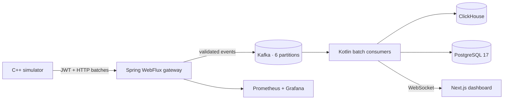

# PulseGrid architecture

## Why the gateway sits before Kafka

Devices do not receive Kafka network access. They authenticate using a short-lived, scoped JWT and send bounded HTTP batches to the WebFlux edge. The gateway validates measurements and publishes accepted events to Kafka. This keeps broker credentials off wearable devices while Kafka absorbs traffic spikes and decouples ingestion from storage.

The Kafka consumer stores high-volume measurements in ClickHouse, records ingestion-batch audit data in PostgreSQL, updates the live WebSocket stream, and exposes custom health gauges. Delivery is at-least-once: every event carries an `event_id`, and downstream queries should deduplicate on that key when strict uniqueness is required.

## Observability

Spring Boot Actuator exposes `/actuator/prometheus`. Prometheus scrapes every five seconds and Grafana is provisioned from version-controlled files with panels for CPU, JVM heap, request rate, p95/p99 latency, accepted/persisted telemetry, live heart rate, oxygen and Kafka lag.

## Security boundary

- `/api/v1/auth/device-token` provisions one-hour HS256 development tokens after device-secret verification.
- `/api/v1/telemetry/**` requires the `telemetry:write` scope.
- Swagger/OpenAPI, health, Prometheus and the demo WebSocket are public inside the local network.
- Production should replace the built-in issuer with OIDC/JWKS, unique per-device credentials, TLS and secret-manager values.

## Benchmark integrity

`load-tests/telemetry.js` can target 10,000 HTTP requests per second and records p95, p99, error rate and rejected events. A CV throughput claim is valid only after a successful run on documented hardware. Keep the generated summary and environment details with the commit that produced them.
